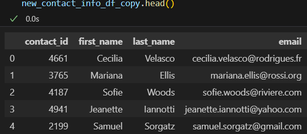

# Project 2: Crowdfunding ETL

## Group:
- Borsukov, Arseniy
- Espiritu, Christine
- Farladansky, Gennadiy
- Graham, JaJuan
- Sarr, Haby
- Sigdel, Krishna

 The code and the output for this project can be found in `ETL_Mini_Project_Starter_Code.ipynb` file.

## Create the Category and Subcategory DataFrames
### Category DataFrame
 The DataFrame contains a "category_id" column that has entries going sequentially from "cat1" to "catn", where n is the number of unique categories.
 The DataFrame has a "category" column that contains only the category titles:
 
 The category DataFrame is exported as `category.csv`

### Subcategory DataFrame
 The DataFrame contains a "subcategory_id" column that has entries going sequentially from "subcat1" to "subcatn", where n is the number of unique subcategories.
 The DataFrame contains a "subcategory" column that contains only the subcategory titles:
 
 The subcategory DataFrame is exported as `subcategory.csv`

## Create the Campaign DataFrame
 The DataFrame has all the columns listed in the requirements for the project:
 
 The campaign DataFrame is exported as `campaign.csv`

## Create the Contacts DataFrame
 The DataFrame has all the columns listed in the requirements for the project:
 
 The contacts DataFrame is exported as `contacts.csv`

## Create the Crowdfunding Database
 Below you can see an ERD for this database:
 
 A database schema can be found in `crowdfunding_db_schema.sql` file. The database has the appropriate primary and foreign keys and relationships.
 We've created a crowdfunding_db using the database schema. Then, we've imported each CSV file into the appropriate table.
 Below you can see the data from each table displayed using a SELECT * statement:
### `SELECT * FROM Category`:
 
### `SELECT * FROM Subategory`:
 
### `SELECT * FROM Campaign`:
 
### `SELECT * FROM Contacts`:
 
